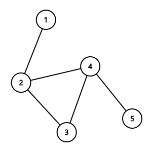

구름이는 도시의 물을 관리하는 관리자이다. 현재 도시에는 물을 잠시 보관하는 물탱크와 물탱크끼리 연결하는 수로가 아래의 조건으로 설치되어 있다.

개의 물탱크와 개의 수로가 있다.
물탱크는 번부터 번까지 있다.
수로가 연결된 물탱크는 양 쪽으로 물이 흐른다.
서로 다른 두 물탱크를 잇는 수로는 최대 하나이다.
물탱크에서 연결된 물탱크는 항상 다른 물탱크이다.
도시의 물은 흐르지 않으면 녹조류가 생기기 때문에, 항상 물이 순환하도록 유지하는 것이 중요하다. 

하지만, 구름이는 순환하는 물이 항상 모든 물탱크를 지나지 않는다는 점을 확인했다. 구름이는 현재 상태의 수로를 확인하고, 순환하는 수로를 찾기로 한다. 이때 순환하는 수로란, 물탱크의 물이 아래의 조건을 만족하면서 끊임없이 순환해야 한다. 

모든 물탱크에는 물이 없는 상태에서 시작한다.
최초의 하나의 물탱크를 선택하여, 물을 채우고 물탱크에 연결된 다른 물탱크에 물을 공급한다.
다른 물탱크에 물을 공급하는 물탱크는 물이 모두 비워질 때까지, 다른 물탱크에 공급한다.
순환하는 수로의 정의를 다음과 같이 정의합니다. 어떤 물탱크에 있던 물이 특정한 수로들을 거쳐 다시 원래의 물탱크로 돌아올 때, 그 수로들의 집합을 순환하는 수로라 한다.
순환하는 수로의 집합의 크기는 최소 개 이상이어야 한다.
아래의 예시를 들어보자.

위의 예시에서 최초로 1번 물탱크에 물을 채우고, 다른 물탱크에 공급을 시작한다. 

1번 물탱크에 연결되어 있는 다른 모든 물탱크에 물이 공급된다. 2번 물탱크에 물이 공급이 되면, 2번 물탱크는 물을 공급해준 1번 물탱크를 제외하고 3, 4번 물탱크에 물을 공급한다.

3번 물탱크의 물 흐름은 {3 > 4 > 2}, {5 > 3 > 4} 를 거친다. 5번 물탱크로 간 물은 다시 물을 공급해준 4번 물탱크로 올 수 없으며, 2번 물탱크는 물을 공급해준 4번과 1번 물탱크로 물을 공급할 수 없다.
4번 물 탱크의 물 흐름은 {4 > 2}, {5 > 3  > 4 > 3} 을 거친다.

물은 조건에 따라 흐르기 때문에, {2 > 3 > 4} 물 탱크만 흐르게 된다. 이를 보고 순환하는 수로라고 한다. 

구름이가 도시의 물 탱크의 개수와 수로의 상태가 주어졌을 때, 가장 큰 순환하는 수로를 찾고, 수로의 집합의 크기와 번호를 오름차순으로 출력하시오. (단, 항상 순환하는 수로가 존재한다)